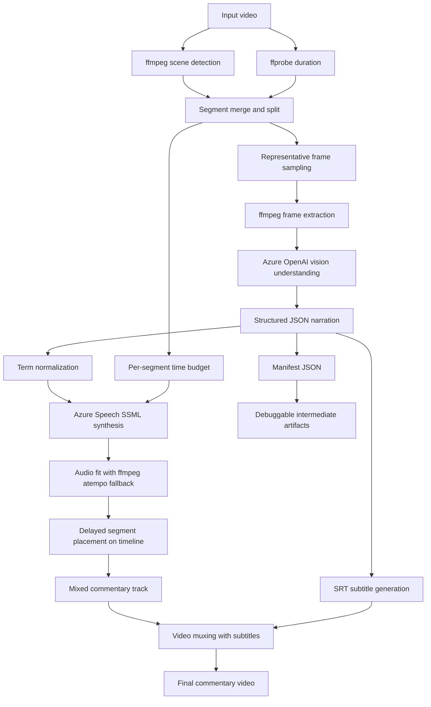

# Visual Commentary Pipeline 方案原理说明

## 1. 项目要解决的问题

这个项目的目标，不是把原视频里的语音翻译成中文，而是**只根据视频画面内容，重新生成一条中文讲解音轨**，并把它和原视频重新封装成一个新的讲解版视频。

它适合的场景是：

- 录屏课件
- 产品演示视频
- Azure 或控制台操作 walkthrough
- Dashboard / Portal 操作展示
- 架构方案讲解录像

这类视频的核心信息往往主要存在于画面切换、页面状态变化、按钮与面板的出现顺序中，而不是原始音轨本身。因此本项目采用了一个非常明确的设计立场：

> **visual-first**，也就是先理解“画面在展示什么”，再生成讲解，而不是先处理音频再做翻译。

## 2. 整体设计思想

整个方案可以概括成一条流水线：

1. 先把视频切成一系列视觉上相对稳定的片段。
2. 从每个片段中抽取代表性关键帧。
3. 把关键帧交给 Azure OpenAI 的视觉能力做结构化理解。
4. 让模型生成一段适合该片段时长的中文讲解。
5. 使用 Azure Speech 把讲解合成为语音，并尽量贴合片段时长。
6. 如果语音仍然偏长，再用 ffmpeg 做最后一层轻微时长拟合。
7. 把所有片段音频按原时间轴拼成完整讲解轨。
8. 最后与原视频封装输出，同时生成字幕和 manifest。

这一设计把复杂问题拆成了三个相对独立的子问题：

- **画面分段**：决定“什么时候该换一段讲解”。
- **内容理解**：决定“这一段应该讲什么”。
- **时长控制**：决定“这段讲解能否在该时间窗内说完”。

### 2.1 架构图



这张图对应的核心控制关系是：

- 左半部分负责把原视频切成可讲解的视觉片段。
- 中间部分负责把关键帧转成结构化中文讲解。
- 右半部分负责把文本变成贴合时间窗的音频，并重新合成回视频。
- `manifest` 和 `SRT` 是并行产物，用于复查、调试和二次利用。

## 3. 端到端工作流

### 3.0 当前工程化工作流（stateful workflow）

当前版本已经不是单次跑完就结束的脚本，而是一个 **manifest 驱动的 stateful workflow**。

它的核心流程可以概括为：

1. 先规划 segment，并把初始状态写入 manifest。
2. 每个 segment 按状态推进：抽帧 → 视觉理解 → narration → QA gate → 最多一次自动 rewrite → TTS → duration gate。
3. 每一步都把状态、decision、reason、retry history 写回 manifest。
4. 最终 accepted segment 不是靠进程内临时列表，而是从 manifest 重建 narration、字幕和混合音轨。
5. 当个别片段有问题时，可以通过 resume / redo 只重做某一段，而不必整视频重跑。

这意味着工程上的“真相源”已经从一次性内存态，转成了持久化的 `commentary_manifest.json`。

### 3.1 视频时长探测

系统首先通过 `ffprobe` 获取输入视频总时长。这个总时长是后续所有时间窗计算的基准，包括：

- 分段边界合法性过滤
- 输出总音轨长度
- 最终混流封装时的对齐

对应实现位于 `video_commentary/pipeline.py` 中的 `ffprobe_duration()`。

### 3.2 基于场景变化的切段

项目使用 ffmpeg 的 `select='gt(scene,threshold)'` 与 `showinfo` 做 scene detection。原理是：

- ffmpeg 会对相邻画面差异打分
- 当差异超过阈值时，认为发生了视觉切换
- 把这些切换时间点提取出来，作为候选边界

这一步的核心不是“准确识别镜头语言”，而是用低成本方式找到 UI、页面、PPT 页、弹窗、面板等明显变化的时间点。

对应实现：`detect_scene_cuts()`。

### 3.3 片段合并与拆分

仅靠 scene cut 还不够，因为原始切点可能出现两种问题：

- **切得太碎**：短片段可能来不及说完一句自然讲解。
- **切得太长**：长片段里包含多个子动作，讲解会过于笼统或超时。

因此项目在 `build_segments()` 中做了二次整形：

1. 过滤极小边界，避免起止附近噪声切点。
2. 对短于 `min_segment` 的片段进行合并。
3. 对长于 `max_segment` 的片段进行均匀拆分。

最终得到的 `Segment` 数据结构包含：

- `id`
- `start`
- `end`
- `duration`

这一步非常关键，因为它决定了后续每段讲解的“可用预算”。从工程角度看，`build_segments()` 实际上是整条管线中最重要的节奏控制器之一。

## 4. 为什么要抽关键帧，而不是整段视频送模态模型

项目没有把整段视频直接提交给模型，而是对每个片段抽取少量关键帧。这是一个成本、稳定性和可控性之间的平衡。

原因有三点：

1. **成本更低**
   对每段只传 1 到 3 张图，比直接处理视频或高密度帧序列更便宜。

2. **语义更聚焦**
   对于 slide、控制台页面、门户操作演示，关键变化通常已经体现在几个代表性画面上。

3. **Prompt 更容易约束**
   模型接收到的是有限的代表帧，任务更像“总结这个片段的视觉要点”，更容易输出结构化 JSON，而不是松散描述。

在 `sample_times()` 中，采样策略也不是均匀无脑抽样：

- 当片段时长小于等于 4 秒，只取中点一帧。
- 当片段更长时，取前段、中段、后段三帧。

这意味着系统试图覆盖：

- 片段刚开始时的页面状态
- 中间的主要展示内容
- 片段结束前的最终状态

对 UI walkthrough 来说，这种三点采样通常足以表达“页面从哪里变到哪里”。

## 5. 视觉理解与中文讲解生成

### 5.1 模型的输入不是开放式问答，而是受约束的生成任务

在 `call_azure_openai_vision()` 中，系统给模型下发的是一个很强约束的任务，核心要求包括：

- 只根据关键帧理解画面
- 不要逐字 OCR 式朗读
- 重点讲“当前在展示什么、焦点是什么、与上一段相比新增了什么”
- 必须控制在当前片段预算内
- 输出必须是 JSON

模型输出被限制为四类字段：

- `title`
- `visible_points`
- `on_screen_text`
- `narration_zh`

这里最重要的是 `narration_zh`，它是后续 TTS 的直接输入；其余字段更多是为了保留结构化中间结果，便于排查与复用。

### 5.2 为什么把上一段讲解也发给模型

Prompt 中包含“上一段讲解”这一上下文，目的是降低相邻片段之间的重复表达。

如果没有这个字段，模型很容易在连续几个相似界面片段里不断重复类似描述，例如：

- “这里展示 Azure 门户主页”
- “这里继续展示 Azure 门户主页”
- “这里仍然展示 Azure 门户主页”

加入上一段文本后，模型更容易生成带有“新增动作”和“当前焦点”的表达，例如：

- 前一段讲主页概览
- 这一段改讲模型选项、参数区、部署按钮或结果面板

因此，这个项目虽然是逐段处理，但并不是完全无状态，而是保留了一点点最小必要上下文。

### 5.3 为什么输出 JSON

要求模型输出 JSON 有几个工程收益：

- 可以直接解析，避免后处理自由文本
- 出错时更容易定位是哪一类字段异常
- 便于把可视要点、屏幕文本、讲解文本分别存档到 manifest

代码里还做了一个兜底策略：如果模型返回的不是纯 JSON，会尝试从文本中用正则提取最外层 JSON 对象再解析。这是为了提高接口在真实环境中的鲁棒性。

## 6. Azure OpenAI 请求路由策略

这个项目兼容两类 Azure OpenAI 接口模式：

1. 较新的 Responses API
2. 较早的 Chat Completions API

在 `azure_openai_uses_responses_api()` 中，系统按 `api_version` 选择路由：

- `2025-04-01` 及以后，走 `/openai/responses`
- 更早版本，走 `/openai/deployments/{deployment}/chat/completions`

这样做的原因是 Azure 的视觉多模态接口在新旧版本中 payload 结构不同：

- Responses API 使用 `input_text` / `input_image`
- Chat Completions 使用 `text` / `image_url`

项目把这层差异封装在 `build_azure_openai_vision_request()` 中，从而让上层业务逻辑无需关心 API 细节。

## 7. 术语归一化的作用

`normalize_terms()` 是一个体量不大、但很实用的工程点。它会把常见误拼或音近词统一成正确术语，例如：

- `ashure` -> `Azure`
- `openaai` -> `OpenAI`
- `deep seek` -> `DeepSeek`

它解决的是两个现实问题：

1. 模型有时会对英文专名做不稳定转写。
2. TTS 输出或字幕中，如果术语不一致，会影响专业感与可读性。

所以它本质上是一个**轻量级术语后处理层**，用于把生成结果往产品演示语境下拉回去。

## 8. 时长控制为什么要做三层

这个项目最有工程含量的部分，不是“能不能生成讲解”，而是“生成的讲解能否稳定塞进每个片段时间窗里”。

如果只有内容生成，没有时长控制，最终视频会出现两类典型问题：

- 讲解没说完，下一段画面已经开始
- 强行压短文本后，讲解过于生硬、不自然

因此项目采用了三层时长控制。

### 8.1 第一层：Prompt 侧长度预算

在调用视觉模型时，Prompt 会明确告知当前片段时长，例如：

- 当前片段持续几秒
- 建议控制在多少中文字符以内

代码里通过 `max_chars = max(18, min(90, int(segment.duration * 8)))` 计算一个粗略字符预算。这个预算并不追求严格语言学精度，而是提供一个足够实用的上限，让模型先从源头上少说废话。

### 8.2 第二层：Azure Speech SSML 控制

在 `build_azure_tts_ssml()` 中，系统为 TTS 构造 SSML，包含两类控制：

- `prosody rate`
- `mstts:audioduration`

其中：

- `prosody rate` 用于整体语速微调
- `mstts:audioduration` 用于向 Azure 明确表达目标时长

另外还支持 `mstts:express-as style`，例如 `professional`，用于让语音风格更适合演示型讲解，而不是闲聊式表达。

### 8.3 第三层：ffmpeg atempo 兜底拟合

即便做了前两层，实际音频长度仍可能略超预算。这时候 `fit_audio_to_budget()` 会计算原始音频时长与预算的比值，并使用 ffmpeg 的 `atempo` 做轻量速度调整。

这里还有一个技术细节：

- ffmpeg 的单个 `atempo` 参数通常只支持有限倍数区间
- 所以 `atempo_chain()` 会把大倍速拆成多个级联过滤器

例如，当需要 `4.0x` 时，会拆成：

```text
atempo=2.0,atempo=2.0
```

这一层只作为兜底，而不是主策略。设计意图是：

- **尽量在文本和 TTS 阶段把时长控制好**
- **最后只做很小的音频修整**

这样自然度损失最小。

## 9. 为什么要预留 segment buffer

每个片段的可用讲解时长不是 `segment.duration` 全部，而是：

$$
\text{budget} = \text{segment duration} - \text{segment buffer}
$$

代码中默认的 `segment_buffer` 是 0.35 秒。这一点很重要，因为如果讲解刚好压满整段时间，会带来两个问题：

- 段与段之间没有呼吸感
- 轻微误差就会导致音轨越界

所以 buffer 的本质，是用一个很小的留白换取整体稳定性。

## 10. 音频拼装方式

单段音频生成完成后，项目不会直接顺序拼接，而是按各自的原始起始时间放回时间轴。

在 `compose_commentary_track()` 中，它先创建一条全长静音轨：

- 采样率 `24000`
- 单声道 `mono`

然后对每段音频做：

- `adelay` 把该段推迟到它对应的起始时间
- `volume=1.25` 做轻微增益
- 最后用 `amix` 混成完整讲解轨
- 再加 `loudnorm` 统一响度

这种做法的意义是：

- 时间定位明确
- 单段讲解彼此独立
- 即使某一段略短，也不会影响后面段落的起点

换句话说，系统生成的不是“一条连续朗读音频”，而是一组放置在固定时间窗内的语音片段集合。

## 11. 最终输出文件包含什么

项目最终会产出四类结果：

1. **讲解版视频**
   原视频画面 + 新的中文讲解音轨 + 字幕轨。

2. **字幕文件**
   通过 `write_srt_file()` 生成 `SRT`。

3. **讲解音频混合轨**
   即整条 commentary track。

4. **manifest JSON**
   记录每个片段的结构化信息，包括：
   - 时间窗
   - 标题
   - 关键可视点
   - 屏幕文字
   - 中文讲解
   - 原始和拟合后的音频路径与时长

这使得项目不仅是“导出一个视频”，也是“保留一份可审计的中间产物”。如果后续要做人工复核、重配音、批量分析，manifest 会非常有价值。

## 12. 核心数据结构

### 12.1 Segment

`Segment` 表示一个待讲解的视频时间片，字段很少，但定义了后续所有预算：

- `id`
- `start`
- `end`
- `duration`

### 12.2 SegmentNarration

`SegmentNarration` 是贯穿后半段流水线的核心对象，除了时间信息外，还包含：

- 视觉摘要标题
- 可视要点列表
- 屏幕文字列表
- 中文讲解文本
- 抽帧路径
- 原始 TTS 音频路径与时长
- 拟合后音频路径与时长

它的作用相当于“每个片段的完整工作记录”。

## 13. 命令行参数背后的工程含义

### 13.1 `--scene-threshold`

控制 scene detection 的敏感度：

- 小一些：更容易切出更多段
- 大一些：更保守，段数更少

### 13.2 `--min-segment`

控制最短可接受片段，避免过碎分段导致讲解不自然。

### 13.3 `--max-segment`

控制最长片段，避免信息过多或讲解超时。

### 13.4 `--segment-buffer`

为每段预留静音/误差空间，提高整体稳定性。

### 13.5 `--base-rate`

设置 Azure Speech 的基础语速，比如 `+0%`、`+5%`。

### 13.6 `--azure-style`

设置语音风格，比如 `professional`，让成品更像正式演示旁白。

## 14. 这个方案为什么适合演示录屏，不适合所有视频

该方案最适合以下类型内容：

- 页面状态相对稳定
- 视觉变化具有明确阶段性
- 核心信息可以从若干关键帧中读出

它不一定适合以下场景：

- 快速运动镜头
- 高密度人物动作视频
- 强依赖原始对白语义的视频
- 需要保留原声情绪与语气的视频

原因很简单：本项目理解的是**画面呈现结构**，不是**原始语音表达**。如果信息主要存在于说话内容而不是屏幕变化，那么 visual-first 就不是最佳策略。

## 15. 方案的核心优势

这个项目的强点主要有四个：

1. **工程闭环完整**
   从视频输入到讲解版视频输出，一条链路打通。

2. **面向演示视频优化**
   不是通用视频理解，而是针对 slide / portal / demo 这种结构化视觉内容。

3. **时长控制多层兜底**
   不是只生成文本，而是确保文本最终能落成可用音频并贴合时间窗。

4. **中间产物可追踪**
   帧图、字幕、manifest、单段音频都被保留，便于调试和复用。

## 16. 可以把它理解成什么

如果从系统角色来理解，这个项目其实是下面三个模块的组合：

- 一个基于 ffmpeg 的**视觉分镜器**
- 一个基于 Azure OpenAI 的**片段讲解生成器**
- 一个基于 Azure Speech + ffmpeg 的**时长可控配音器**

三者串起来，最终形成一个“自动给演示录屏配中文讲解”的生产流水线。

## 17. 总结

这个项目的原理并不复杂，但工程上抓住了一个关键事实：

> 对于演示类视频，最重要的是画面切换与页面状态变化，而不是原始音轨。

因此它没有做传统的语音翻译链路，而是建立了一个以视觉片段为中心的生成式管线：

- 用 scene detection 决定讲解边界
- 用关键帧提炼片段内容
- 用视觉模型生成中文讲解
- 用多层时长控制把讲解压进时间窗
- 用混音和封装把结果还原回完整视频

最终结果是一个更适合产品演示、平台 walkthrough 和课件录屏的中文讲解版视频生成方案。